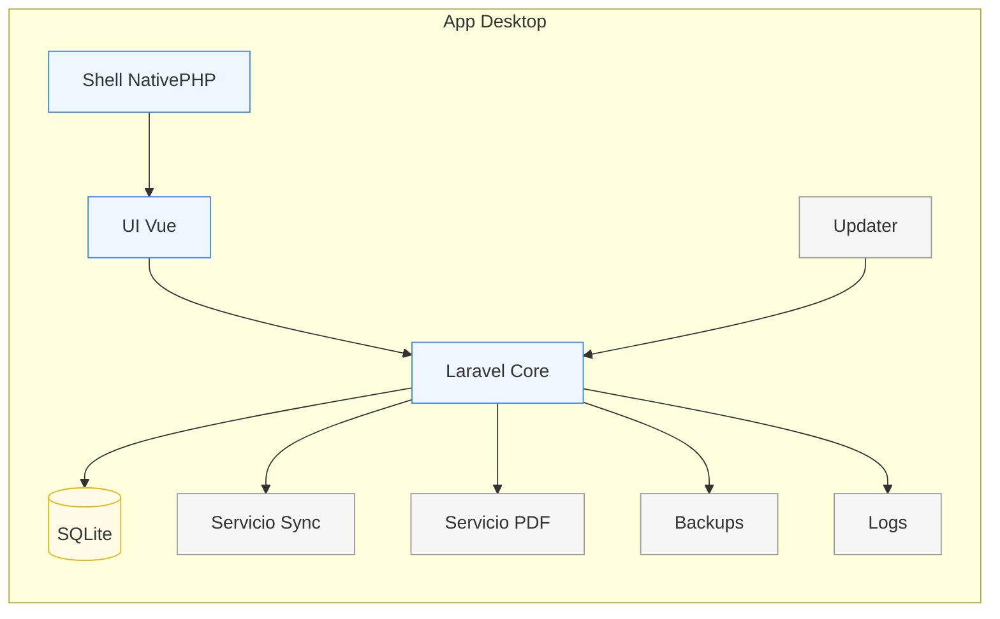

# C4 — Contenedores

```mermaid
flowchart LR
  subgraph DesktopApp[App Desktop]
    shell[Shell NativePHP]:::cmp
    ui[UI Vue]:::cmp
    core[Laravel Core]:::cmp
    sqlite[(SQLite)]:::db
    sync[Servicio Sync]:::svc
    pdf[Servicio PDF]:::svc
    backups[Backups]:::svc
    logs[Logs]:::svc
    updater[Updater]:::svc
  end

  shell --> ui
  ui --> core
  core --> sqlite
  core --> sync
  core --> pdf
  core --> backups
  core --> logs
  updater --> core

  classDef cmp fill:#eef6ff,stroke:#3b82f6,stroke-width:1px;
  classDef svc fill:#f6f6f6,stroke:#999,stroke-width:1px;
  classDef db fill:#fffbe6,stroke:#eab308,stroke-width:1px;
```
