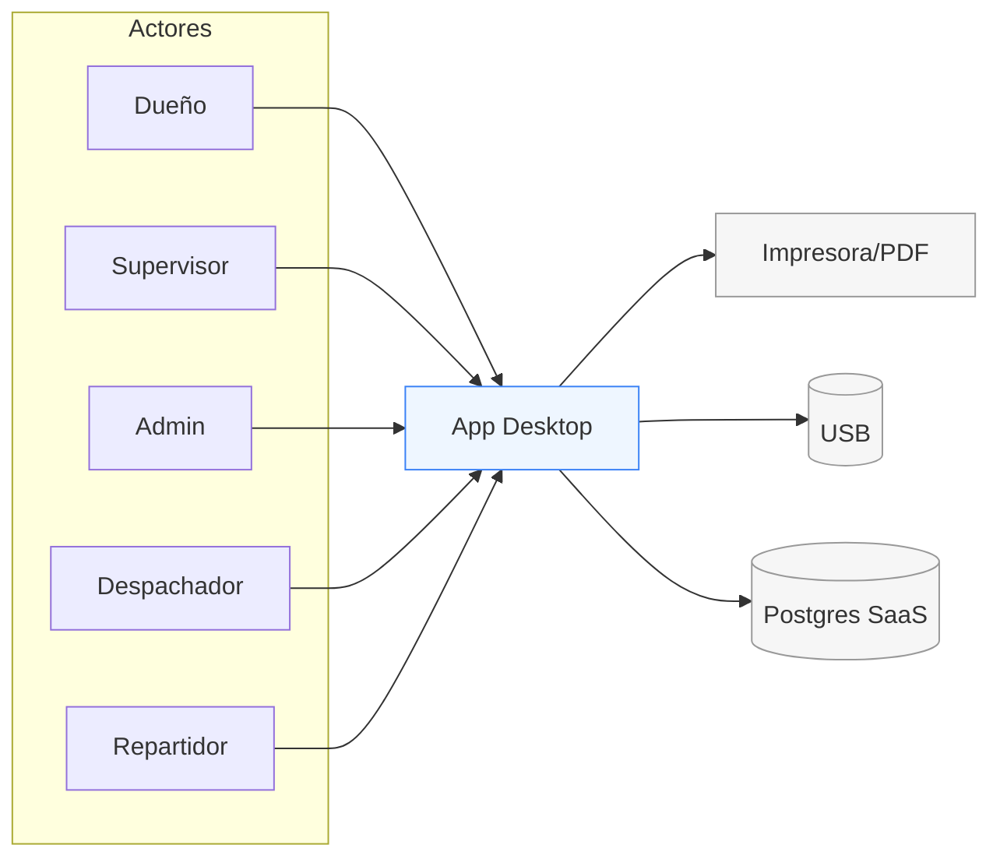

# C4 — Contexto

```mermaid
flowchart LR
  subgraph Actores
    dueno[Dueño]
    supervisor[Supervisor]
    admin[Admin]
    despachador[Despachador]
    repartidor[Repartidor]
  end

  app[App Desktop]:::app
  impresora[Impresora/PDF]:::ext
  usb[(USB)]:::ext
  saas[(Postgres SaaS)]:::ext

  dueno --> app
  supervisor --> app
  admin --> app
  despachador --> app
  repartidor --> app
  app --> impresora
  app --> usb
  app --> saas

  classDef app fill:#eef6ff,stroke:#3b82f6,stroke-width:1px;
  classDef ext fill:#f6f6f6,stroke:#999,stroke-width:1px;
```
