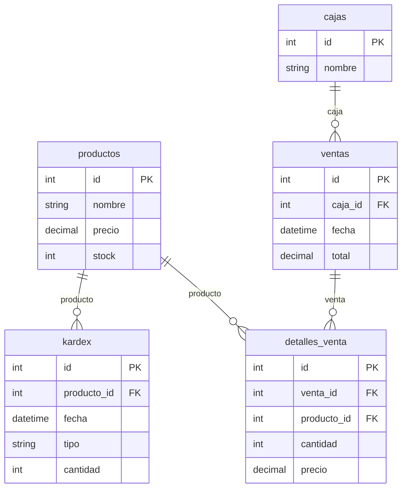

```mermaid
erDiagram
    productos {
        int id PK
        string nombre
        decimal precio
        int stock
    }
    cajas {
        int id PK
        string nombre
    }
    ventas {
        int id PK
        int caja_id FK
        datetime fecha
        decimal total
    }
    kardex {
        int id PK
        int producto_id FK
        datetime fecha
        string tipo
        int cantidad
    }
    detalles_venta {
        int id PK
        int venta_id FK
        int producto_id FK
        int cantidad
        decimal precio
    }

    productos ||--o{ kardex : "producto"
    productos ||--o{ detalles_venta : "producto"
    cajas ||--o{ ventas : "caja"
    ventas ||--o{ detalles_venta : "venta"
```
